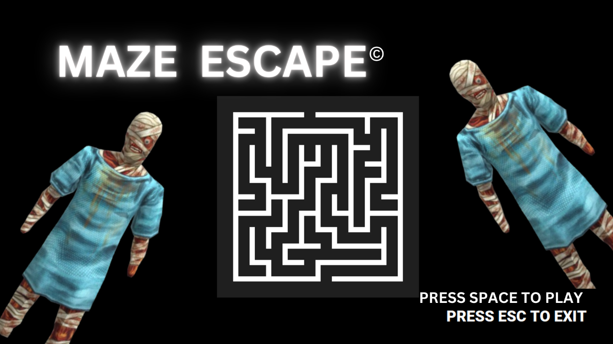
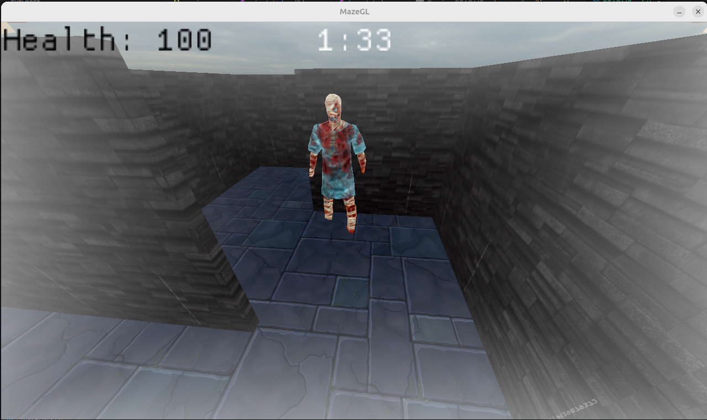
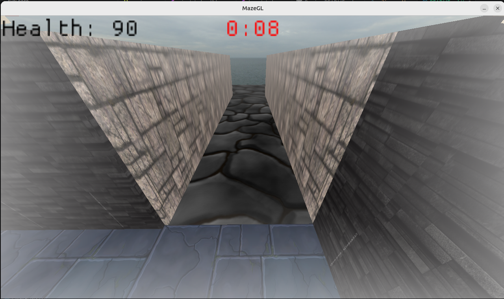
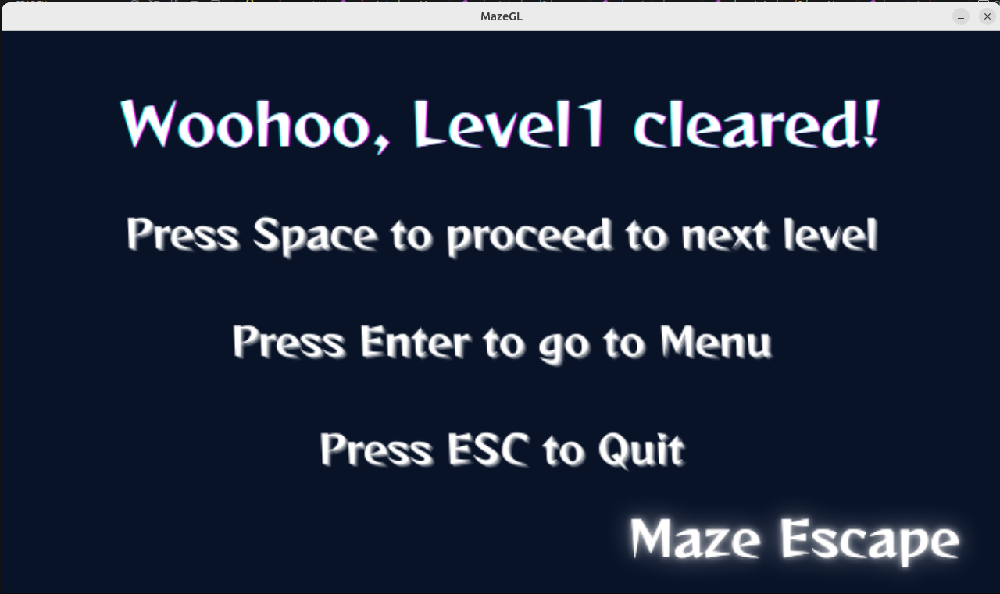
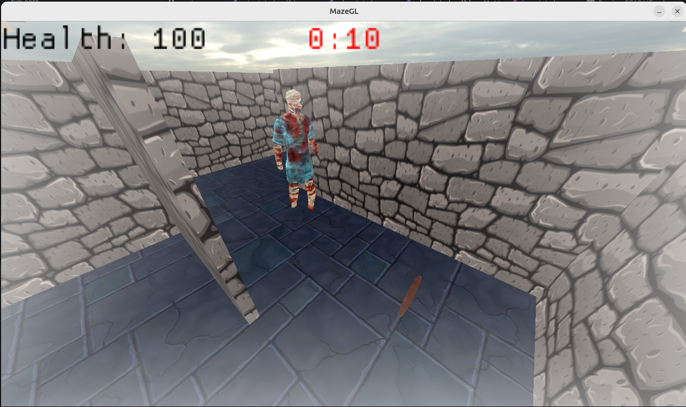
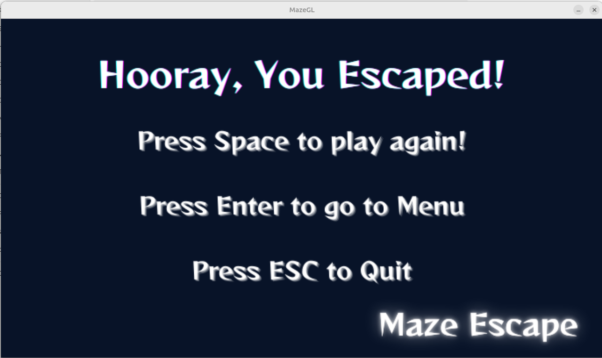

# 🎮 RenderCore-MazeEscape - A Custom 3D Graphics Engine & Maze Escape Game

RenderCore is a simple 3D graphics engine built from the ground up with **OpenGL** and **C++17**, featuring an immersive first-person maze escape game. This project demonstrates graphics programming concepts like forward rendering, post-processing effects, and entity-component system (ECS) architecture.

---

## 📋 Table of Contents

- [Features](#-features)
- [Screenshots](#-screenshots)
- [Project Structure](#-project-structure)
- [Architecture Overview](#-architecture-overview)
- [Game Mechanics](#-game-mechanics)
- [Configuration System](#-configuration-system)
- [Building & Running](#-building--running)
- [Technologies & Dependencies](#-technologies--dependencies)

---

## ✨ Features

### RenderCore - The Graphics Engine
- **OpenGL Core Profile** rendering with support for complex 3D scenes
- **Forward Rendering Pipeline** with dynamic lighting (directional, point, and spot lights)
- **Advanced Shading**: Support for textured and lit materials
- **Post-Processing Effects**: Customizable framebuffer-based effects
- **Sky Sphere Rendering**: Atmospheric background rendering
- **Entity-Component System (ECS)**: Flexible and extensible scene management
- **Depth Testing & Face Culling**: Optimized rendering performance
- **Blending & Transparency**: Proper handling of transparent objects

### MazeEscape - Game Features
- **Two-Level Campaign**: Progressive difficulty with Level 1 and Level 2
- **Dynamic Enemies**: AI-controlled adversaries with collision detection
- **Health System**: Dynamic health points with visual feedback
- **Power-ups**: Health restoration items scattered throughout the maze
- **Time Management**: Collectible time extensions and countdown timer
- **First-Person Controls**: Smooth WASD-based player movement
- **Audio System**: Immersive sound effects and background music
- **Main Menu & State System**: Professional menu UI with multiple game states
- **Win/Loss Conditions**: Multiple ending scenarios based on gameplay

---

## 📸 Screenshots

### Start Menu

*Main menu interface where players begin their maze escape adventure*

### Gameplay - Level 1 Start

*First-person view inside the maze with an enemy shown*

### Gameplay - Approaching Exit

*Final approach to the exit while avoiding enemies and managing health*

### Level Complete

*Transition screen after successfully completing Level 1, allowing progression to Level 2*

### Gameplay - Level 2

*First-person view inside the maze with enemies shown, obstacles, and collectibles*

### Victory Screen

*Final victory screen displayed after successfully completing all levels*

---

## 📁 Project Structure

```
RenderCore-MazeEscape/
├── source/                    # Main C++ source code
│   ├── main.cpp              # Application entry point
│   ├── common/               # Shared utilities and components
│   │   ├── application.hpp/cpp        # Core application framework
│   │   ├── asset-loader.hpp/cpp       # Asset deserialization system
│   │   ├── components/                # ECS component definitions
│   │   ├── ecs/                       # Entity-Component-System implementation
│   │   ├── systems/                   # Game systems (rendering, physics, control)
│   │   ├── shader/                    # Shader management classes
│   │   ├── mesh/                      # 3D mesh loading and handling
│   │   ├── material/                  # Material and texture management
│   │   └── ...
│   └── states/                # Game state implementations
│       ├── menu-state.hpp             # Main menu state
│       ├── play-state.hpp             # Level 1 gameplay state
│       ├── play-state-level2.hpp      # Level 2 gameplay state
│       ├── win-state.hpp              # Level 1 completion screen
│       ├── win-state-level2.hpp       # Final victory screen
│       ├── loss-state.hpp             # Game over screen
│       └── *-test-state.hpp           # Graphics testing states
│
├── assets/                    # Game assets
│   ├── shaders/              # GLSL vertex and fragment shaders
│   │   ├── textured.vert/frag       # Textured rendering shader
│   │   ├── lighted.vert/frag        # Lit rendering shader
│   │   ├── tinted.vert/frag         # Solid color shader
│   │   └── postprocess/             # Post-processing effect shaders
│   ├── models/                   # 3D model files (OBJ format)
│   ├── screenshots/              # screenshots from the game
│   ├── textures/                 # Texture images (PNG, JPG)
│   ├── audio/                    # Sound effects and background music
│   └── ...
│
├── config/                    # JSON configuration files
│   ├── app.jsonc             # Main application configuration
│   ├── play_level1.jsonc     # Level 1 environment configuration
│   ├── play_level2.jsonc     # Level 2 environment configuration
│   └── ...                   # Additional test configurations
│
├── build/                    # CMake build artifacts (generated)
├── bin/                      # Compiled executable
├── CMakeLists.txt            # CMake build configuration
└── README.md                 # This file
```

---

## 🏗️ Architecture Overview

### Engine Architecture

The RenderCore engine is built using an **Entity-Component-System (ECS)** pattern, providing flexibility and performance:

- **Entities**: Game objects in the scene (player, enemies, walls, collectibles)
- **Components**: Data containers (transform, mesh, material, health, etc.)
- **Systems**: Logic processors that operate on entities with specific components
  - `ForwardRenderer`: Renders all entities with proper lighting and materials
  - `PlayerControllerSystem`: Handles player input and movement
  - `MovementSystem`: Updates entity positions based on velocity
  - `FreeCameraControllerSystem`: Manages camera for testing/debugging

### Rendering Pipeline

1. **Asset Loading**: Shaders, meshes, and textures loaded from configuration
2. **Scene Setup**: Entities deserialized from JSON configuration files
3. **Update Phase**: All systems update entity state
4. **Render Phase**:
   - Render to framebuffer with lighting
   - Apply post-processing effects
   - Render to screen with UI overlays

### State Management

The game uses a state machine pattern with the following states:
- `menu`: Main menu interface
- `play`: Level 1 gameplay
- `play-2`: Level 2 gameplay
- `win`: Level 1 completion screen
- `win-2`: Final victory screen
- `loss`: Game over screen

---

## 🎮 Game Mechanics

### Player System
- **Health Points (HP)**: Players start with 100 HP
- **Health Drain**: Collision with enemies causes 10 HP damage
- **Game Over**: Health reaches 0 or time expires
- **Controls**: 
  - `W/A/S/D` - Movement
  - `Mouse` - Look around and Rotation
  - `Shift` - Fast Movement
  - `Space` - Proceed to next level
  - `ESC` - Menu

### Enemies
- **AI Behavior**: Enemies patrol the maze and detect nearby players
- **Collision Damage**: Running into enemies reduces player health
- **Spawn Locations**: Defined in level configuration files
- **Visual Representation**: 3D models with animated textures

### Collectibles

**Time Extensions (⏱️)**
- Located throughout the maze
- Pickup: Adds 15 seconds to remaining time
- Visual: Clock icon models
- Purpose: Extend the time limit to explore and survive longer

**Power-ups (💚)**
- Health restoration items
- Pickup: Restores 5 HP per power-up
- Visual: Special character models (Toad texture)
- Purpose: Heal from enemy damage and extend survival

### Time System
- **Level Duration**: 2 minutes per level by default
- **Countdown Timer**: Displayed on screen (MM:SS format)
- **Warning**: Timer turns red when 30 seconds remain
- **Time Extension**: Collectible items add extra time
- **Failure Condition**: Time expiration leads to game over

### Level Progression
- **Level 1**: Introduction to maze mechanics with basic enemies
- **Level 2**: More complex maze layout with increased difficulty
- **Victory**: Complete Level 2 to reach the victory screen

---

## ⚙️ Configuration System

Game environments and mechanics are defined using **JSONC** (JSON with comments) configuration files, making it easy to create new levels without recompilation.

### Configuration Structure

**Main Application Config** (`config/app.jsonc`):
```jsonc
{
  "start-scene": "menu",
  "window": { "title": "MazeGL", "size": { "width": 1280, "height": 720 } },
  "game": {
    "play-level-1-config": "config/play_level1.jsonc",
    "play-level-2-config": "config/play_level2.jsonc"
  }
}
```

**Level Configuration** (`config/play_level1.jsonc`):
```jsonc
{
  "health": 100,           // Starting player health
  "power-up": 5,           // Health restored per power-up
  "damage": 10,            // Damage taken per enemy collision
  "duration-minutes": 2,   // Time limit in minutes
  "duration-seconds": 0,   // Additional seconds
  "extra_time": 15,        // Seconds added per time collectible
  "scene": {
    "assets": { ... },     // Shader, texture, mesh, and material definitions
    "world": { ... }       // Entity definitions (player, enemies, walls, collectibles)
  }
}
```

### Creating New Levels

To create a new level:
1. Add shader/texture/mesh/material definitions to the configuration
2. Define the world with entities (position, rotation, scale, components)
3. Place enemies at desired locations
4. Scatter power-ups and time extensions
5. Reference the config file in `app.jsonc`

---

## 🛠️ Building & Running

### Prerequisites

- **C++17 Compiler**: Visual Studio 2017+, GCC 9+, or Clang 5+
- **CMake**: Version 3.10 or newer
- **OpenGL**: Support for OpenGL 4.5+

### Build Instructions

```bash
# Clone the repository
git clone https://github.com/alhusseingamal/RenderCore.git
cd RenderCore

# Create build directory (on Linux/macOS)
mkdir build
cd build
cmake ..
make

# Or on Windows with Visual Studio
mkdir build
cd build
cmake ..
cmake --build . --config Release
```

### Running the Game

```bash
# From the project root directory
./bin/GAME_APPLICATION

# Or specify a custom config file
./bin/GAME_APPLICATION -c config/app.jsonc

# Run for a specific number of frames (useful for batch testing)
./bin/GAME_APPLICATION -f 300
```

### run.sh
This is is a bash script that builds and runs the game.  
Run it using:
```bash
./run.sh
```

### Testing

The project includes comprehensive testing configurations:

```bash
# Test individual graphics features
./bin/GAME_APPLICATION -c config/shader-test/test-0.jsonc
./bin/GAME_APPLICATION -c config/mesh-test/test-0.jsonc
./bin/GAME_APPLICATION -c config/texture-test/test-0.jsonc
./bin/GAME_APPLICATION -c config/transform-test/test-0.jsonc
./bin/GAME_APPLICATION -c config/material-test/test-0.jsonc
```

---

## 🔧 Technologies & Dependencies

### Core Technologies
- **OpenGL 4.5**: Graphics API for rendering
- **C++17**: Modern C++ standard
- **CMake**: Build system

### Key Dependencies

| Library | Purpose | Version |
|---------|---------|---------|
| **GLFW** | Window and input management | Latest |
| **GLAD** | OpenGL loader | Latest |
| **GLM** | Mathematics (vectors, matrices) | 0.9.9+ |
| **Dear ImGui** | UI overlays and debug tools | Latest |
| **nlohmann/json** | JSON parsing with comments | 3.x |
| **MiniAudio** | Audio processing and playback | Latest |

### Build Artifacts
- **GLFW**: Compiled from source during build
- **GLAD**: OpenGL function loader
- **ImGui**: UI and debugging overlay

---

## Learning Outcomes

This project demonstrates:

1.  GPU Programming with GLSL shaders
2.  Vertex array objects and buffer management
3.  3D transformations (translation, rotation, scaling)
4.  Advanced pipeline states (depth testing, face culling, blending)
5.  Texture mapping and sampling
6.  Material systems and shader composition
7.  Entity-Component-System architecture
8.  Forward rendering with dynamic lighting
9.  Post-processing effects via framebuffers
10. Practical game development with graphics engine integration

---

## Key Features Explained

### Shader System
- Multiple shader programs for different rendering needs
- Tinted rendering (solid colors with materials)
- Textured rendering (with texture coordinates)
- Lighted rendering (with normal-based lighting)
- Post-processing shaders for visual effects

### Mesh System
- OBJ model loading and caching
- Vertex buffer object (VBO) management
- Efficient mesh rendering with VAO binding

### Material System
- Combines shaders with textures and samplers
- Material properties and pipeline state configuration
- Material reuse across multiple entities

### ECS Implementation
- Flexible entity composition
- System iteration over matching entities
- Decoupled game logic and rendering

---

## Notes

- The project includes extensive test configurations for graphics features (shader tests, mesh tests, texture tests, etc.)
- All game environments are configured through JSON files, allowing for easy level design and iteration
- Audio integration provides immersive gameplay experience
- The codebase is well-structured for educational purposes and serves as an excellent learning resource for graphics programming

---

## License

This project is part of an academic computer graphics course at the **Computer Engineering Department of the Faculty of Engineering at Cairo University.**

---

## Authors

Developed as a comprehensive learning project for advanced graphics programming and game engine architecture.
- Alhussein Ali
- Hassan Hatem
- Ahmed Gaber
- Mohamed Ali
---

**Enjoy your maze escape adventure! 🎮✨**
